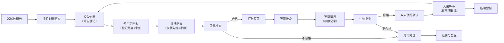
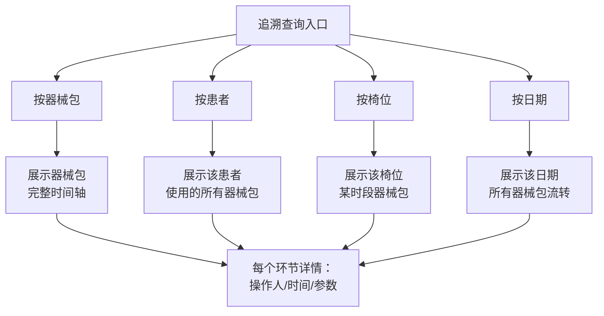

## 1. 产品概述

面向单体口腔门诊护士长与器械护士的器械全链路追溯管理系统，串联"器械使用后回收到再次上台前"的每一步操作，形成完整可核查的追溯链路。系统以快速登记、清晰追溯为核心，帮助门诊在忙碌接诊中留下完整记录，在患者投诉、院感抽查或内部复盘时能迅速查清器械去向与责任环节。

## 2. 核心功能

### 2.1 用户角色

| 角色 | 登录方式 | 核心权限 |
|------|----------|----------|
| 护士长 | 账号密码 | 全功能操作、双人放行确认、异常处理、追溯查询 |
| 器械护士 | 账号密码 | 器械包建档、清洗消毒登记、灭菌登记、日常操作 |

### 2.2 功能模块

1. **器械包台账**：器械包建档、条码管理、包内器械清单、状态总览
2. **清洗消毒登记**：回收登记、清洗步骤勾选、关键参数录入、质量检查
3. **灭菌放行**：灭菌批次管理、参数录入、双人放行确认、无菌有效期
4. **异常处理**：缺件破损上报、异常批次追溯、处理记录跟踪
5. **库存与借还**：库存总览、临期预警、借还登记、开包使用反登记
6. **追溯查询**：按器械包/患者/椅位/日期四个入口的全链路追溯

### 2.3 页面详情

| 页面名称 | 模块名称 | 功能描述 |
|---------|---------|---------|
| 器械包台账 | 器械包列表 | 搜索、筛选、分页展示所有器械包 |
| 器械包台账 | 器械包建档 | 新增/编辑器械包基本信息、包内器械清单 |
| 器械包台账 | 条码管理 | 生成条码、打印条码、扫码识别 |
| 器械包台账 | 状态总览 | 显示各状态器械包数量统计（使用中/清洗中/灭菌中/已灭菌/异常） |
| 清洗消毒登记 | 回收登记 | 扫码录入回收器械包、登记回收时间、使用患者、椅位 |
| 清洗消毒登记 | 清洗步骤 | 多步骤勾选（初洗-酶洗-漂洗-终末漂洗-消毒-干燥） |
| 清洗消毒登记 | 参数录入 | 清洗温度、时间、酶液浓度等关键参数 |
| 清洗消毒登记 | 质量检查 | 清洗质量检查结果、检查人签字 |
| 灭菌放行 | 批次管理 | 创建灭菌批次、关联器械包 |
| 灭菌放行 | 灭菌参数 | 灭菌温度、压力、时间、灭菌方式 |
| 灭菌放行 | 放行确认 | 双人核对签字、放行时间、有效期计算 |
| 灭菌放行 | 有效期提醒 | 临期/过期包醒目提示 |
| 异常处理 | 异常上报 | 缺件/破损/清洗不合格/灭菌失败等异常登记 |
| 异常处理 | 异常列表 | 待处理/处理中/已闭环异常管理 |
| 异常处理 | 批次追溯 | 异常批次一键追溯所有关联器械包 |
| 异常处理 | 处理记录 | 异常处理过程、责任人、闭环时间 |
| 库存与借还 | 库存总览 | 已灭菌库存统计、按有效期排序 |
| 库存与借还 | 临期预警 | 临期（7天内）/过期包红色预警 |
| 库存与借还 | 借还登记 | 外借登记、归还确认 |
| 库存与借还 | 开包使用 | 扫码开包、登记使用患者/椅位/医生 |
| 追溯查询 | 多入口查询 | 按器械包/患者/椅位/日期四个查询入口 |
| 追溯查询 | 链路展示 | 时间轴展示器械包完整生命周期 |
| 追溯查询 | 责任追溯 | 每个环节的操作人、时间、参数记录 |

## 3. 核心流程

### 3.1 器械包全生命周期流程

器械包从建档到使用的完整闭环流程：

### 3.2 追溯查询流程

用户可从四个入口进入追溯，最终展示完整链路：

## 4. 用户界面设计

### 4.1 设计风格

- **主色调**：医疗蓝（#1E88E5）—— 专业、可信、冷静
- **辅助色**：安全绿（#43A047）— 合格/放行；警示橙（#FB8C00）— 临期；危险红（#E53935）— 异常/过期
- **中性色**：深灰 #37474F 为主文字，浅灰 #F5F7FA 为背景
- **按钮风格**：圆角 8px，实心主按钮 + 描边次按钮，悬停微阴影
- **字体**：中文使用系统无衬线字体，清晰易读为第一优先级
- **布局风格**：左侧导航 + 顶部状态栏 + 右侧内容区，卡片式布局
- **图标风格**：线性图标（lucide-react），简洁专业

### 4.2 设计理念

- **高效优先**：核心操作三步内完成，扫码即录入
- **清晰醒目**：状态色区分明确，异常信息高亮
- **专业可信**：医疗感设计，信息完整可追溯
- **忙碌适配**：大按钮、高对比度、操作反馈明确

### 4.3 页面设计概览

| 页面名称 | 模块名称 | UI 元素 |
|---------|---------|---------|
| 器械包台账 | 顶部统计卡 | 5 个状态统计卡片，不同颜色区分 |
| 器械包台账 | 列表区 | 表格形式，条码编号、名称、状态、效期 |
| 器械包台账 | 建档弹窗 | 表单式弹窗，包内器械清单可增删 |
| 清洗消毒登记 | 回收扫码区 | 大输入框 + 扫码按钮，实时显示已回收列表 |
| 清洗消毒登记 | 步骤区 | 6 步清洗流程卡片，勾选变绿带对勾 |
| 清洗消毒登记 | 参数区 | 关键参数数字输入框，带单位 |
| 灭菌放行 | 批次卡片 | 批次编号、时间、状态、包数量 |
| 灭菌放行 | 参数区 | 温度、压力、时间参数显示 + 录入 |
| 灭菌放行 | 放行区 | 双人签字区域，双确认按钮 |
| 异常处理 | 异常列表 | 按紧急程度排序，红色标识待处理 |
| 异常处理 | 上报表单 | 异常类型选择、描述、图片上传（占位） |
| 库存与借还 | 库存总览 | 按效期排序，临期红色背景闪烁提示 |
| 库存与借还 | 借还记录 | 借出人、时间、状态 |
| 追溯查询 | 入口选择 | 4 个大卡片入口，图标+文字 |
| 追溯查询 | 时间轴 | 竖向时间轴，节点状态色区分 |

### 4.4 响应式

- 桌面端优先（1440px 基准），适配 1024px 以上屏幕
- 考虑门诊可能使用平板操作，做触控优化：按钮最小 44px
- 左侧导航在窄屏可折叠为图标模式
