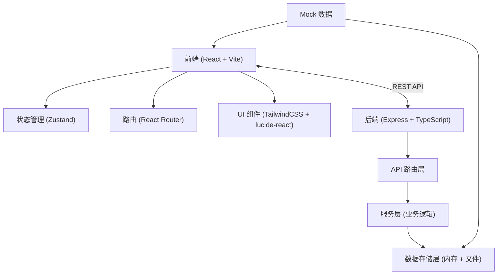
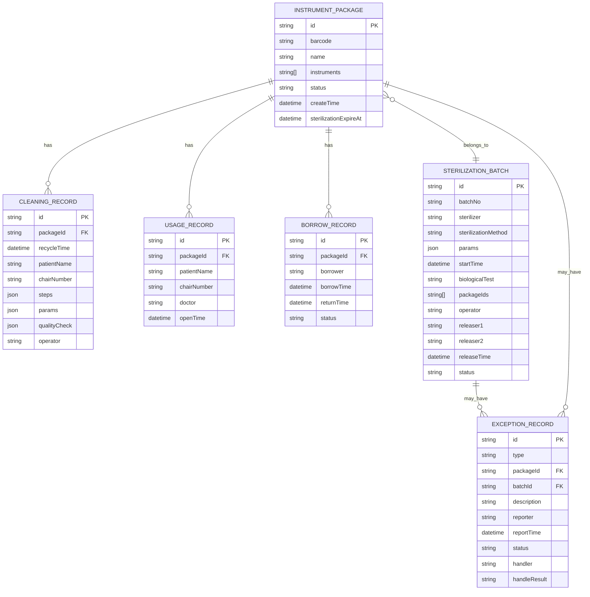

## 1. 架构设计



## 2. 技术描述

- **前端框架**：React 18 + TypeScript + Vite
- **状态管理**：Zustand（轻量级，适合中小型应用）
- **路由**：React Router v6
- **UI 样式**：TailwindCSS 3
- **图标库**：lucide-react
- **后端框架**：Express 4 + TypeScript
- **数据存储**：内存存储（演示用）+ JSON 文件持久化
- **初始化工具**：vite-init

## 3. 路由定义

| 路由路径 | 页面名称 | 说明 |
|---------|---------|------|
| /packages | 器械包台账 | 器械包列表、建档、状态总览 |
| /cleaning | 清洗消毒登记 | 回收登记、清洗步骤、参数录入 |
| /sterilization | 灭菌放行 | 批次管理、灭菌参数、双人放行 |
| /exceptions | 异常处理 | 异常上报、处理跟踪、批次追溯 |
| /inventory | 库存与借还 | 库存总览、临期预警、借还管理 |
| /trace | 追溯查询 | 四入口追溯、时间轴展示 |

## 4. API 定义

### 4.1 类型定义

```typescript
// 器械包状态
type PackageStatus = 'in_use' | 'recycled' | 'cleaning' | 'cleaned' | 'sterilizing' | 'sterilized' | 'expired' | 'abnormal';

// 器械包
interface InstrumentPackage {
  id: string;
  barcode: string;
  name: string;
  instruments: string[];
  status: PackageStatus;
  createTime: string;
  sterilizationExpireAt?: string;
  lastUsedAt?: string;
  currentPatient?: string;
  currentChair?: string;
}

// 清洗记录
interface CleaningRecord {
  id: string;
  packageId: string;
  packageBarcode: string;
  recycleTime: string;
  patientName: string;
  chairNumber: string;
  steps: {
    initialWash: boolean;
    enzymeWash: boolean;
    rinse: boolean;
    finalRinse: boolean;
    disinfection: boolean;
    drying: boolean;
  };
  params: {
    enzymeConcentration: number; // mg/L
    washTemperature: number; // ℃
    washTime: number; // 分钟
    disinfectionTemp: number; // ℃
    disinfectionTime: number; // 分钟
  };
  qualityCheck: {
    passed: boolean;
    inspector: string;
    checkTime: string;
    remark?: string;
  } | null;
  operator: string;
  createdAt: string;
}

// 灭菌批次
interface SterilizationBatch {
  id: string;
  batchNo: string;
  sterilizer: string;
  sterilizationMethod: 'pressure_steam' | 'ethylene_oxide' | 'plasma';
  params: {
    temperature: number; // ℃
    pressure: number; // kPa
    duration: number; // 分钟
  };
  startTime: string;
  endTime?: string;
  biologicalTest: 'pending' | 'passed' | 'failed';
  packageIds: string[];
  operator: string;
  releaser1?: string;
  releaser2?: string;
  releaseTime?: string;
  status: 'running' | 'completed' | 'released' | 'failed';
  validDays: number;
}

// 异常记录
interface ExceptionRecord {
  id: string;
  type: 'missing' | 'damaged' | 'cleaning_failed' | 'sterilization_failed' | 'other';
  relatedPackageId?: string;
  relatedBatchId?: string;
  description: string;
  reporter: string;
  reportTime: string;
  status: 'pending' | 'processing' | 'closed';
  handler?: string;
  handleResult?: string;
  handleTime?: string;
}

// 使用记录
interface UsageRecord {
  id: string;
  packageId: string;
  packageBarcode: string;
  patientName: string;
  patientId?: string;
  chairNumber: string;
  doctor: string;
  openTime: string;
  usedAt: string;
}

// 借还记录
interface BorrowRecord {
  id: string;
  packageId: string;
  borrower: string;
  borrowTime: string;
  returnTime?: string;
  status: 'borrowed' | 'returned';
  remark?: string;
}
```

### 4.2 接口列表

| 方法 | 路径 | 说明 |
|------|------|------|
| GET | /api/packages | 获取器械包列表 |
| GET | /api/packages/:id | 获取器械包详情 |
| POST | /api/packages | 新增器械包 |
| PUT | /api/packages/:id | 更新器械包 |
| DELETE | /api/packages/:id | 删除器械包 |
| GET | /api/packages/:id/trace | 获取器械包追溯链路 |
| POST | /api/cleaning | 创建清洗记录 |
| PUT | /api/cleaning/:id | 更新清洗记录 |
| POST | /api/cleaning/:id/quality-check | 清洗质量检查 |
| GET | /api/sterilization/batches | 获取灭菌批次列表 |
| POST | /api/sterilization/batches | 创建灭菌批次 |
| PUT | /api/sterilization/batches/:id | 更新灭菌批次 |
| POST | /api/sterilization/batches/:id/release | 双人放行 |
| GET | /api/exceptions | 获取异常列表 |
| POST | /api/exceptions | 上报异常 |
| PUT | /api/exceptions/:id | 处理异常 |
| GET | /api/inventory | 获取库存列表 |
| POST | /api/usage | 开包使用登记 |
| POST | /api/borrow | 借出登记 |
| POST | /api/borrow/:id/return | 归还确认 |
| GET | /api/trace/by-package/:barcode | 按器械包追溯 |
| GET | /api/trace/by-patient | 按患者追溯 |
| GET | /api/trace/by-chair | 按椅位追溯 |
| GET | /api/trace/by-date | 按日期追溯 |

## 5. 前端项目结构

```
src/
├── components/          # 公共组件
│   ├── Layout.tsx       # 布局组件（侧边栏+顶部）
│   ├── StatusBadge.tsx  # 状态标签组件
│   ├── Modal.tsx        # 弹窗组件
│   └── ...
├── pages/               # 页面组件
│   ├── PackageLedger.tsx    # 器械包台账
│   ├── CleaningRegister.tsx # 清洗消毒登记
│   ├── SterilizationRelease.tsx # 灭菌放行
│   ├── ExceptionHandling.tsx  # 异常处理
│   ├── InventoryBorrow.tsx    # 库存与借还
│   └── TraceQuery.tsx         # 追溯查询
├── store/               # 状态管理 (Zustand)
│   └── useAppStore.ts
├── types/               # 类型定义
│   └── index.ts
├── utils/               # 工具函数
│   ├── date.ts
│   └── barcode.ts
├── hooks/               # 自定义 Hooks
│   └── ...
├── mock/                # Mock 数据
│   └── data.ts
├── App.tsx
├── main.tsx
└── index.css
```

## 6. 数据模型

### 6.1 ER 图



### 6.2 状态流转说明

器械包状态流转：
- `in_use`（使用中）→ 使用后回收 → `recycled`（已回收）
- `recycled` → 开始清洗 → `cleaning`（清洗中）
- `cleaning` → 清洗完成质检合格 → `cleaned`（已清洗）
- `cleaned` → 进入灭菌批次 → `sterilizing`（灭菌中）
- `sterilizing` → 灭菌合格放行 → `sterilized`（已灭菌）
- `sterilized` → 过期 → `expired`（已过期）
- `sterilized` → 开包使用 → `in_use`（使用中）
- 任何环节出现异常 → `abnormal`（异常）
